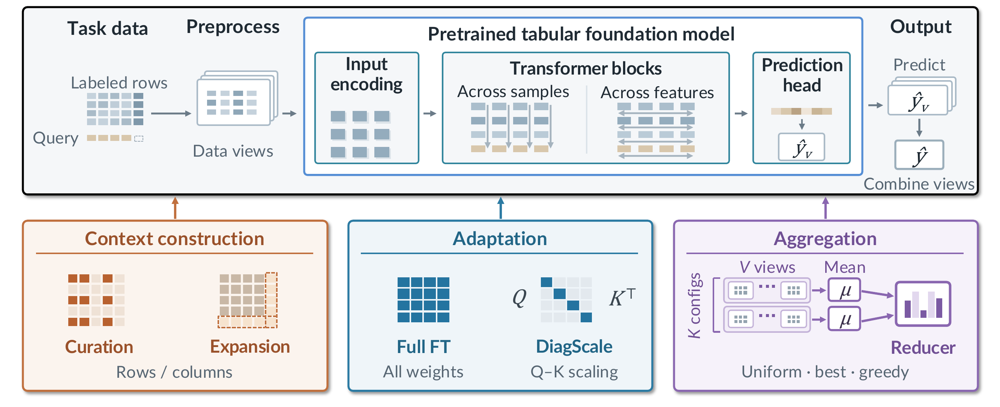

<div align="center">

# Test-Time Compute for Tabular Foundation Models

**Mechanisms, Gains, and Limits**

[](https://arxiv.org/abs/2610.12005)
[](https://huggingface.co/datasets/nkh/test-time-compute-for-tabular-foundation-models-results)
[](LICENSE)
[](envs/environment.yml)

</div>

<p align="center">
  
</p>

Which forms of test-time compute improve the predictions of strong pretrained tabular foundation
models (TFMs)? We study three axes on **TabPFN-3**, **TabICL v2** and **TabFM**, evaluated on all
51 datasets of [TabArena](https://github.com/autogluon/tabarena) and on large OpenML tables:

- **Adaptation** changes the model parameters: full finetuning and **DiagScale**, a
  zero-initialized diagonal multiplier on the query–key similarity.
- **Aggregation** changes the prediction pool: a pool of TabPFN-3 preprocessing/inference
  configurations, combined by out-of-fold greedy ensemble selection.
- **Context construction** changes the conditioning data: attention-guided row retrieval, which
  also scores source pools larger than fit in GPU memory.

This repository contains the evaluation protocol, these methods and the configs of the paper's
main experiments.

## Key findings

- **DiagScale matches full finetuning with 0.003–0.03% of the parameters** on all three
  backbones.
- **Aggregation needs both a diverse pool and a selective reducer.** More native views saturate
  quickly; over 96 configurations, greedy selection lowers error by 2.4%, whereas uniform
  averaging of the same predictions increases it.
- **Context construction helps in some regimes.** Attention-guided retrieval improves TabPFN-3 on
  some large tables and extends it to source pools of up to 10M rows; the context-expansion methods
  we tested give no consistent gain.
- **Adaptation and aggregation combine** on TabPFN-3, at about 40x the compute of DiagScale
  alone.

## Main results

TabArena Elo (see [Evaluation](#evaluation)); ΔElo is against the TabArena default of the same
backbone (for TabFM, our frozen run). GPU-h: total over the 816 cells on one H100.

| Backbone | Method | Elo | ΔElo | GPU-h |
|---|---|---:|---:|---:|
| TabPFN-3 | frozen (8 views) | 1658 | +1 | 0.5 |
| | 32 native views | 1675 | +21 | 1.7 |
| | full finetuning | 1681 | +25 | 7.7 |
| | **DiagScale** | 1682 | +26 | 6.6 |
| | 96 configurations + greedy selection | 1721 | +67 | 247.5 |
| | **DiagScale + aggregation** | **1748** | **+93** | 253.1 |
| TabICL v2 | frozen | 1592 | +9 | 1.2 |
| | full finetuning | 1659 | +77 | 10.9 |
| | **DiagScale** | 1664 | +82 | 10.8 |
| TabFM | frozen | 1792 | +0 | 19.3 |
| | full finetuning | 1820 | +28 | 61.9 |
| | **DiagScale** | 1812 | +20 | 59.4 |

## Installation

Requires Python 3.11 and a CUDA GPU (the paper used one 80 GB H100 per run).

```bash
git clone https://github.com/kanghui-learning/test-time-compute-for-tabular-foundation-models.git
cd test-time-compute-for-tabular-foundation-models
conda env create -f envs/environment.yml   # creates the env "tfm-ttc"
conda activate tfm-ttc
bash scripts/install_forks.sh              # patched tabpfn / tabicl / tabfm, tabarena @ abd24c7
pip install -e .
```

The installer clones each backbone at a fixed upstream commit, applies [`patches/`](patches/README.md)
(finetuning hooks, DiagScale, bf16 TabFM inference) and checks the result against the paper's code.

<details>
<summary><b>Model weights, data and caches</b></summary>

Weights are downloaded by each backbone on first use.

| Backbone | Weights | License |
|---|---|---|
| TabPFN-3 | Prior Labs, downloaded by `tabpfn`: accept the license at [ux.priorlabs.ai](https://ux.priorlabs.ai), then `export TABPFN_TOKEN=<API key>` (`TABPFN_MODEL_CACHE_DIR` sets the cache) | TabPFN-3 model license (non-commercial) |
| TabICL v2 | [`jingang/TabICL`](https://huggingface.co/jingang/TabICL), downloaded by `tabicl` | BSD-3-Clause |
| TabFM | [`google/tabfm-1.0.0-pytorch`](https://huggingface.co/google/tabfm-1.0.0-pytorch): accept the license on the model page, then `hf auth login` | TabFM Non-Commercial License v1.0 |

TabArena datasets and splits are downloaded from OpenML on first use (`OPENML_CACHE_DIR` sets the
cache). All outputs go to `$TTC_RUNS_DIR` (default `./runs`); fit caches can be large, so point it
at a data disk.

The paper environment used AutoGluon nightly `1.5.1b20260702`; `envs/environment.yml` pins the
closest stable release (1.5.0), which reproduced the frozen results bit for bit in our checks.

</details>

## Quick start

Run DiagScale on TabPFN-3 on two small TabArena datasets (diabetes and airfoil_self_noise, one
fold); it prints a TabArena leaderboard for these two datasets:

```bash
python -m ttc.run configs/smoke/tabpfn3_diagscale.yaml
```

Every config in `configs/` has a quick version in `configs/smoke/`. Elo is defined on the full
816-cell protocol; to reproduce a paper Elo from the released results:

```bash
hf download nkh/test-time-compute-for-tabular-foundation-models-results \
    --repo-type dataset --local-dir hf_results
python -m ttc.eval.elo \
    --candidate hf_results/raw/tabpfn3_diagscale/results_per_split.csv \
    --reference-field hf_results/raw/tabfm_frozen/results_per_split.csv \
    --baseline "TA-TABPFN-3 (default)"            # ΔElo +26
```

## Reproducing the main experiments

```bash
python -m ttc.run configs/<backbone>/<method>.yaml
```

Each config runs one method on the full TabArena protocol (51 datasets, 816 dataset × repeat ×
fold cells) and writes `runs/eval/<tag>/results_per_split.csv`. Finished cells are cached, so a
long run can be split across jobs with a `datasets:` list in the config.

| Config | Method |
|---|---|
| [`tabpfn3/frozen.yaml`](configs/tabpfn3/frozen.yaml) | frozen TabPFN-3, 8 views |
| [`tabpfn3/full_ft.yaml`](configs/tabpfn3/full_ft.yaml) | full finetuning, lr 1e-6 |
| [`tabpfn3/diagscale.yaml`](configs/tabpfn3/diagscale.yaml) | DiagScale, lr 3e-2 |
| [`tabpfn3/native_views_{8,16,32,64}.yaml`](configs/tabpfn3) | V native views |
| [`tabpfn3/aggregation_96.yaml`](configs/tabpfn3/aggregation_96.yaml) | 96 configurations + greedy selection |
| [`tabpfn3/diagscale_aggregation_96.yaml`](configs/tabpfn3/diagscale_aggregation_96.yaml) | DiagScale, then the 96-configuration pool |
| [`tabiclv2/{frozen,full_ft,diagscale}.yaml`](configs/tabiclv2) | TabICL v2: frozen / full FT, lr 1e-5 / DiagScale, lr 3e-2 |
| [`tabfm/frozen.yaml`](configs/tabfm/frozen.yaml) | frozen TabFM, bf16, 32 views; the 68th Elo reference |
| [`tabfm/{full_ft,diagscale}.yaml`](configs/tabfm) | TabFM: full FT, lr 1e-4 / DiagScale, lr 1e-2 |

Adaptation: at most 30 epochs, patience 8, AdamW weight decay 0.01, one learning rate per backbone
and method; 2 views for training and validation, the backbone's default views at deployment (8, or
32 for TabFM). The pretrained weights are kept when no epoch improves validation.

Aggregation: the pool is fixed by its seed; [`configs/aggregation_pool/`](configs/aggregation_pool)
lists the 96 configurations (the first K form the K-configuration pool), and
`tests/test_aggregation_pool.py` checks that the sampler reproduces them.

### Row retrieval on large tables

```bash
python -m ttc.benchmarks.row_pool_prep --datasets Higgs
python -m ttc.benchmarks.row_modelaware --datasets Higgs --n-avail 10000000 --seeds 0 \
    --arms full modelaware --overflow split
```

Top-500 attention retrieval per query, queries clustered by their retrieved sets; pools above
about 4M rows are scored in 2M-row blocks, and oversized unions are truncated or split
(`--overflow`). Datasets, data preparation and the paper's grid:
[`docs/retrieval.md`](docs/retrieval.md).

## Evaluation

```bash
python -m ttc.eval.paired --candidate <a.csv> --baseline <b.csv>
```

- **Elo** (`ttc.eval.elo`, as in [Quick start](#quick-start)): TabArena's Bradley–Terry fit against
  the fixed 68-entry reference field, one candidate per fit, calibrated to RandomForest (default) =
  1000. The 67 TabArena references are fetched from TabArena; frozen TabFM comes from
  `--reference-field`.
- **Paired error change:** log error ratios averaged within each dataset, then over datasets, with
  a 95% dataset-bootstrap interval.

See [`docs/evaluation.md`](docs/evaluation.md).

## Repository structure

```
configs/            experiment configs (one per paper method), smoke versions, the 96-configuration pool
src/ttc/
  run.py            YAML config -> one TabArena run
  models.py         full finetuning / DiagScale for TabPFN-3, TabICL v2 and TabFM
  agg_model.py      TabPFN-3 configuration pool + greedy reducer
  agg_ft_model.py   DiagScale followed by the configuration pool
  aggregation/      configuration search space and reducers
  backbones/        TabFM wrapper; TabICL and TabFM finetuning loops
  benchmarks/       TabArena runner; large-table row retrieval
  eval/             Elo and paired error changes
patches/            patches to tabpfn, tabicl and tabfm, with their licenses
scripts/            fork installer, export of results for Hugging Face
docs/               evaluation and retrieval details
tests/              unit tests (pool reproducibility, Elo, retrieval split)
```

<details>
<summary><b>Reproducibility notes</b></summary>

- Frozen inference and every aggregation member reproduced the paper runs bit for bit.
- GPU finetuning is not bitwise deterministic: two runs of the same config differed by up to 0.9%
  in error on a cell.

</details>

## Citation

```bibtex
@article{ning2026testtime,
  title   = {Test-Time Compute for Tabular Foundation Models: Mechanisms, Gains, and Limits},
  author  = {Ning, Kanghui and Bilo{\v{s}}, Marin and Wilson, James T. and Zhang, Yilang and Rasul, Kashif
             and Song, Dongjin and Schneider, Anderson and Nevmyvaka, Yuriy},
  journal = {arXiv preprint arXiv:2610.12005},
  year    = {2026}
}
```

## Acknowledgements

This work builds on [TabArena](https://github.com/autogluon/tabarena) for the benchmark and
evaluation, and on the [TabPFN](https://github.com/PriorLabs/TabPFN),
[TabICL](https://github.com/soda-inria/tabicl) and [TabFM](https://github.com/google-research/tabfm)
backbones. The row-retrieval pipeline adapts the retrieval of
[LimiX](https://arxiv.org/abs/2509.03505) to TabPFN-3.

Built with PriorLabs-TabPFN.

## License

The code in this repository is released under the [Apache License 2.0](LICENSE). The patches in
`patches/` modify third-party code under its own license ([`THIRD_PARTY_NOTICES.md`](THIRD_PARTY_NOTICES.md)):
TabPFN under the Prior Labs License v1.2, TabICL under BSD-3-Clause, and TabFM and TabArena under
Apache-2.0. Model weights are not part of this repository and are subject to their own licenses.
